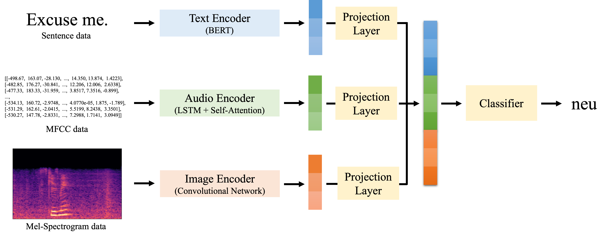

# Natural-Language-Process-Team-Project
2021 COSE461 Team 14   
[@noparkee](https://github.com/noparkee) [@Xenor99](https://github.com/Xenor99) [@jooeun9199](https://github.com/jooeun9199)

# SER with TextEmbedding
Use not only Audio data features but also **Text data features**      
You can see our paper: [**Speech Emotion Recognition with Text Features.pdf**](https://github.com/noparkee/Natural-Language-Process-Team-Project/blob/main/Speech%20Emotin%20Recognition%20with%20Text%20Features.pdf)

   
An overview of our proposed model, which consists of three featurizers and one classifier.

## Environment
- Python3
- PyTorch
- librosa-0.8.1

## Data Set
[IEMOCAP](https://sail.usc.edu/iemocap/)
- Use only 4 labels
- Combines _happy_ class with _excitement_ class

## Conclusion
**Text data can improve SER accuracy**

|Model|UA(%)|WA(%)|
|------|---|---|
|(1): audio|51.47|52.75|
|(2): audio + text|**68.29**|69.2|
|(3): audio + image|51.01|53.12|
|(4): audio + text + image|68.2|**71.02**|

- Model (1) use only audio features
- Model (2) use audio features and text features
- Model (3) use audio features and image features
- Model (4) use audio features, text features, and image features

## Code Files
#### preprocess
- make_description.py: define data path, align the data -> create description.pkl
- make_mel_spectrogram.py: create mel-spectrogram images, and save with path of that image (edit description.pkl)
- make_audio.py: create mfcc vector from wav file -> create audio.pkl
- make_data.py: join description.pkl with audio.pkl -> create data.pkl
#### src
- train_model.py: main file
- model.py: define our model
- network.py: define the featurizers
- data.py: dataloader
- utils.py: set seeds, calculate score

---
## Reference Paper
[Empirical Interpretation of Speech Emotion Perception with Attention Based Model for Speech Emotion Recognition](http://www.interspeech2020.org/uploadfile/pdf/Thu-2-2-8.pdf)
- SOTA
- Use only audio data
- BiLSTM + attention

[Multimodal Speech Emotion Recognition and Ambiguity Resolution](https://arxiv.org/pdf/1904.06022v1.pdf)
- Use both audio and text data
- audio data: Use 8 hand-crafted features
- text data: Use TF-IDF
- ML models, simple LSTM, etc.
